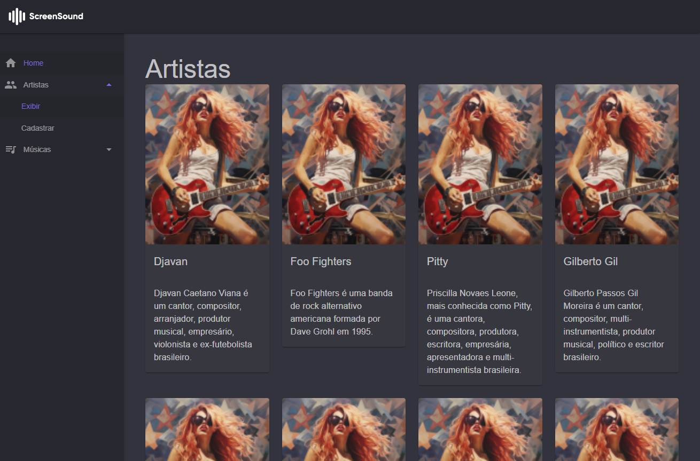

# ScreenSound
Aplicação para gerenciamento de artistas e suas múcicas.



### Backlog

- Uma ideia seria adicionar o serviço do MinIO para armazenamento de arquivos.

## Dependências
Abaixo as dependências necessárias para rodar a aplicação.
No docker compose, temos os serviços abaixo:

* ~~PostgresSQL~~
* MySql

## Migrations

Executar todas as migrações quando iniciar uma nova aplicação

Dotnet CLI
```bash
dotnet ef database update
```
### Comandos úteis

Criar a migração

```bash
dotnet ef migrations add PopularTabelaMusicas --project ./ScreenSound.Dados/
```

Criando uma migração
```bash
dotnet ef migrations add CriarTebelasArtistaEMusica --project ScreenSound.Dados --startup-project ScreenSound.API
```

Remover uma migração

```bash
dotnet ef migrations remove --project ./ScreenSound.Dados/
```

## Executando o projeto no editor favorito

### Execução do Projeto no Rider

1.  **Abra as Configurações de Execução:**
    * No Rider, clique no menu suspenso de configurações de execução (canto superior direito).
    * Selecione "Editar Configurações...".

2.  **Crie uma Configuração de Execução Composta:**
    * Clique no botão "+".
    * Selecione "Composto".
    * Dê um nome (ex: "Web + API").

3.  **Adicione as Configurações de Execução da Web e da API:**
    * Em "Para executar antes de iniciar", clique em "+".
    * Selecione "Executar configuração".
    * Adicione as configurações dos projetos web e API (ASP.NET Core Web Application e ASP.NET Core Web API).

4.  **Salve e Execute:**
    * Clique em "Aplicar" e "OK".
    * Selecione a configuração composta e clique em "Play".

#### Observações

* Certifique-se de que as portas e dependências estejam corretamente configuradas.
* Verifique os logs do Docker e do aplicativo em caso de erros.

### Execução do Projeto no Visual Studio

1.  **Configure a inicialização de vários projetos:**
    * No Solution Explorer, clique com o botão direito na solução e selecione "Propriedades".
    * Em "Propriedades da Solução", selecione "Projetos de Inicialização".
    * Selecione "Vários projetos de inicialização".
    * Defina a ação de inicialização para os projetos web e API como "Iniciar".
    * Defina a ordem de inicialização, se necessário.

2.  **Execute o projeto:**
    * Clique no botão "Iniciar" (ou pressione F5) para executar os projetos web e API simultaneamente.

#### Observações

* Certifique-se de que as portas e dependências estejam corretamente configuradas.
* Verifique os logs do Docker e do aplicativo em caso de erros.

Ajuda com [Gemini](https://gemini.google.com)